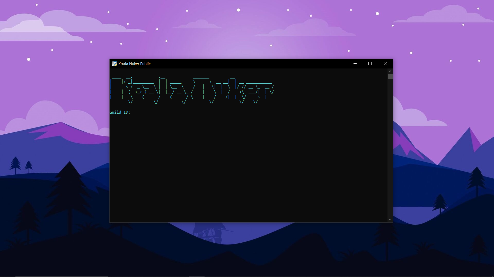
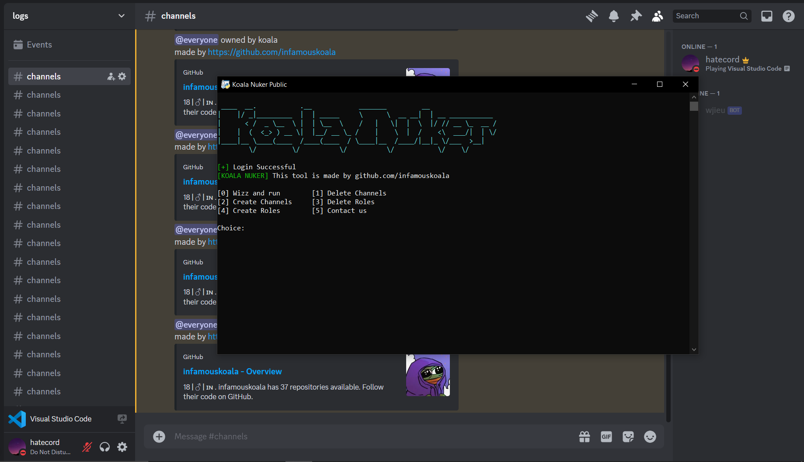
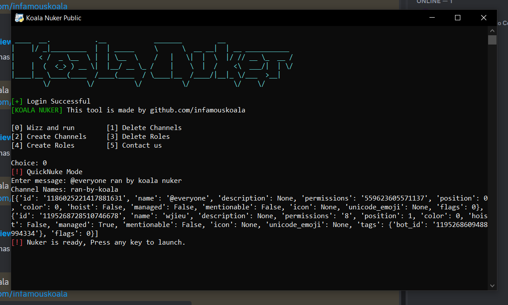
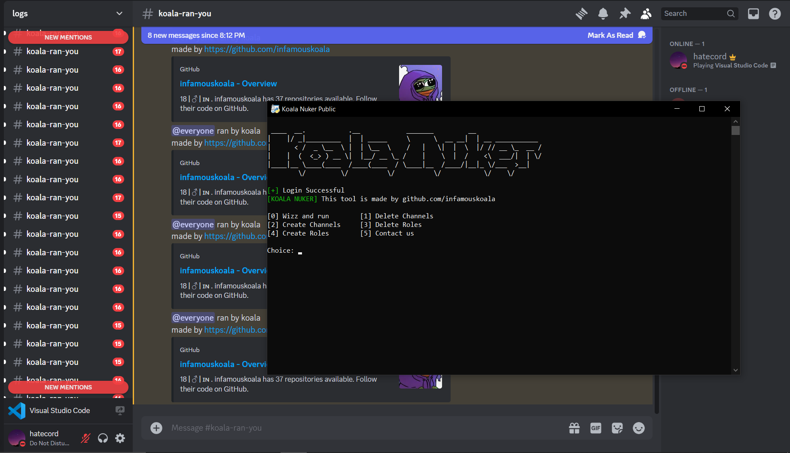

# KOALA NUKER
- This is probably one of the most demanded and awaited script my community has ever asked for. After getting a 60$ bid, I decided to upload it open source and free because im a good guy :) (and also because i dont care about the community anymore)

- If you decide to use this in your YouTube video or something, make sure to give proper credits (mention the github repo in description or in a pinned comments) to the tool to prevent any further problems with the copyright holders.

# LICENSE
- This repo is Licensed under Creative Commons Attribution-NonCommercial-NoDerivs 3.0 Unported License. Do not distribute or consider performing any modifications to the code without permission

- You cannot distribute it or use it for commercial purposes. 

# INSTALLATION
- Just run the main.py, there is nothing to install or anything. Its a simple requests + threading nuker

- Known issue: breaks when running on any python version below 3.11.6, this is due to the nuker depending on the following patches in 3.11.6

# PREVIEW

# TERMS
- Nuking/Raiding of discord servers is purely against Discord's of service and I do not condone the use of any tools that promote or do so. I will not be responsible for the damage caused by this tool. Use this responsibly.
